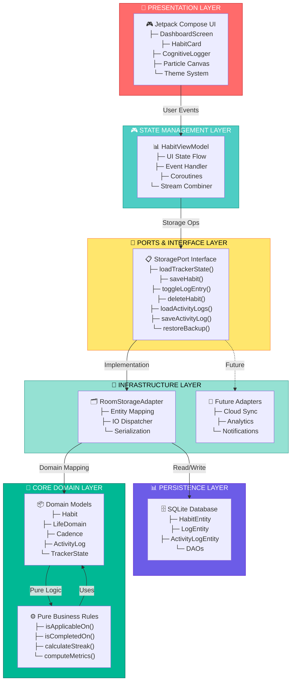
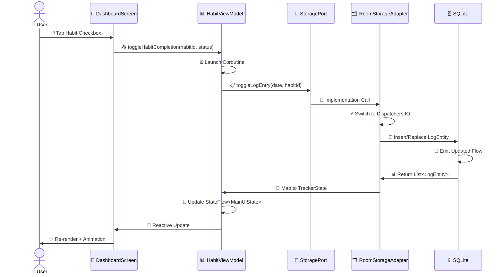
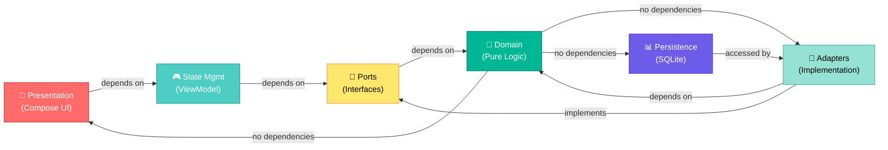

# ⚡ HabitEngine ⚡
----
> [Download Now](https://github.com/SudegoraAnkit/HabitEngine/blob/main/.build-outputs/app-release.apk)
----

> **Quantify Your Daily Energy, Habits, and Discipline into Clean, Immutable Data. Designed for Devs, Built Offline-First.**

HabitEngine is a highly optimized, beautifully designed, distraction-free, and privacy-focused habit loop tracker and productivity logger. It is tailored specifically for developers, scientists, and data-driven individuals who want to track their daily habits, cognitive state, and life balance without intrusive tracking, ads, or cloud subscriptions.

| Live Status | Platform | Build System | Database | Architecture | License |
|---|---|---|---|---|---|
|  | Android (SDK 24+) | Gradle (Kotlin DSL) | SQLite + Jetpack Room | MVVM + Clean Architecture | MIT |

---

## 📸 App Preview

Here is a glimpse of the minimalist, dark-mode dashboard with its customizable widgets:

```
+-------------------------------------------------------------+
|  ⚡ HabitEngine                   [ FAQ & Settings ] [ 🌍 EN ]|
|  "The dopamine loop of execution."                           |
+-------------------------------------------------------------+
|  [🎯 TODAY'S RADAR]                                         |
|  ■ Health   (3/4) [████████████░░░] 75%                      |
|  ■ Professional (2/2) [███████████████] 100%                 |
|  ■ Personal (1/3) [█████░░░░░░░░░░] 33%                      |
|  ■ Family   (2/2) [███████████████] 100%                 |
+-------------------------------------------------------------+
|  [🔥 HEATWAVE STREAK: 12 DAYS] [⚡ EFFICIENCY: 82%]           |
+-------------------------------------------------------------+
|  [➕ ADD NEW HABIT]                                          |
|  [📂 COGNITIVE LOGGER - REALTIME TERMINAL]                  |
+-------------------------------------------------------------+
```
*(Screenshot path reference: `/app/src/main/res/drawable/app_preview.png`)*

---

## 🏗️ System Architecture

HabitEngine follows a **Hexagonal Architecture (Ports & Adapters)** pattern with strict separation of concerns. This ensures the core business logic remains independent of frameworks and infrastructure details.

### Architecture Diagram



### Data Flow: User Interaction Example



### Architecture Layers Breakdown



### Key Architectural Benefits

| Benefit | Implementation |
|---------|----------------|
| **🧪 Testability** | Core domain is framework-free; pure functions can be tested in isolation |
| **🔧 Maintainability** | Clear separation of concerns; changes to UI don't affect database logic |
| **📈 Scalability** | New adapters can be added without modifying core domain (Cloud sync, analytics, etc.) |
| **⬅️ Dependency Inversion** | Infrastructure depends on core; core never depends on frameworks |
| **📴 Offline-First** | StoragePort abstraction allows seamless local→cloud transition |
| **⚡ Performance** | IO operations isolated on Dispatchers.IO; Main thread never blocked |

---

## 🎯 App Purpose

Traditional habit trackers are filled with intrusive ads, monthly subscriptions, and cloud synchronization that compromises personal privacy. HabitEngine is different. 

Its **primary purpose** is to provide a fully offline, zero-friction, highly customizable visual space where you can create micro-triggers, track them consistently using flexible schedules, and maintain a complete searchable log of your daily habits and cognitive state.

### 🎁 Value to the User

1. **Psychologically Backed Habit Loop**: Follows the *Cue ➔ Action ➔ Reward* blueprint. Setup actions tied to existing triggers (e.g., "When I sit down with my morning coffee, I will write 1 page").
2. **Four Dimensional Life Balance**: Forces you to stay balanced across 4 essential areas: **Health**, **Professional**, **Personal**, and **Family**. No more burning out in one area while losing vitality in another.
3. **Interactive Cognitive Logger (Activity Terminal)**: Register raw workflow, focuses, ambient states, or mental state logs on-the-fly. Keep an exact data catalog of your daily focus and distractions.
4. **Absolute Privacy & Control**: 100% offline. Features instant, high-speed CSV or JSON database backup & import right inside the app settings. No telemetry, no external servers.

### 🛠️ Value to the Developer

1. **Pragmatic Material 3 Compose Layout**: Highly complex yet fully reactive Jetpack Compose setup demonstrating custom canvas particle systems, animated expandable dialogs, multi-language system support, and theme orchestration.
2. **Modern Architecture**: Demonstrates explicit division of concerns using Model-View-ViewModel (MVVM) and Android Clean Architecture.
3. **Local DB with Room + KSP**: Exemplary database implementation of relations, destructive fallback sandbox strategies, and transaction safety.
4. **Agile Localization**: Modular enum-based dictionary structure (`AppLanguage`) supporting 6 major global developer languages seamlessly.

---

## 📂 Repository Structure

HabitEngine is structured around Hexagonal Architecture (Ports and Adapters), separating our domain logic, port definitions, and infrastructure adapters:

```
habitengine/
├── 📚 docs/                               # Developer documentation suite
│   ├── 01_project_overview.md             # Motivations & core value loop
│   ├── 02_requirements_use_cases.md       # Requirements & user flows
│   ├── 03_system_architecture.md          # Hexagonal Architecture layout
│   ├── 04_data_model_apis.md              # SQLite schemas & backup payload schemas
│   ├── 05_implementation_details.md       # Compose particles, localizations, cadence
│   ├── 06_challenges_solutions.md         # In-memory aggregations & custom serializations
│   ├── 07_incident_postmortems.md         # Postmortems (Gradle, Keystores, Secrets Plugin)
│   └── 08_personal_learnings.md           # Technical developer learnings
│
├── 📱 app/src/main/java/com/example/      # Main application source
│   ├── 💎 core/                           # Pure Business Domain Layer
│   │   ├── domain/                        # Entities & business rules (Models.kt)
│   │   └── ports/                         # Decouplers (StoragePort.kt interface)
│   │
│   ├── 💾 infrastructure/adapters/        # Framework & Infrastructure Adapters
│   │   ├── database/                      # Room SQLite persistence (RoomStorageAdapter.kt)
│   │   └── ui/                            # MVVM Jetpack Compose interface (DashboardScreen.kt)
│   │
│   └── 🎨 ui/theme/                       # Presets for application color & typography
│
├── ⚙️ gradle/                             # Gradle Wrapper properties & wrapper files
├── 📋 build.gradle.kts                    # Root build setup
├── 📋 settings.gradle.kts                 # Project dependency repositories
├── 🔑 my-upload-key.jks                   # Play Store production upload key
└── 🔐 .env                                # Key secrets configuration for compiling
```

- **[Core Domain Models](file:///d:/2026/Project/HabitEngine/app/src/main/java/com/example/core/domain/Models.kt)**: Houses the central definitions of habit loops (`Habit`, `LifeDomain`, `Cadence`, `ActivityLog`).
- **[Storage Port Interface](file:///d:/2026/Project/HabitEngine/app/src/main/java/com/example/core/ports/StoragePort.kt)**: Decoupled boundary declaring how the UI fetches data and updates storage independently of implementation.
- **[Room SQLite Adapter](file:///d:/2026/Project/HabitEngine/app/src/main/java/com/example/infrastructure/adapters/database/RoomStorageAdapter.kt)**: SQLite implementation of the StoragePort using Room ORM.
- **[ViewModel State Controller](file:///d:/2026/Project/HabitEngine/app/src/main/java/com/example/infrastructure/adapters/ui/HabitViewModel.kt)**: Combines DB Flow updates and theme preferences into reactive UI state.
- **[Compose UI Views](file:///d:/2026/Project/HabitEngine/app/src/main/java/com/example/infrastructure/adapters/ui/DashboardScreen.kt)**: Draws the user interface, custom sparklines, regional flows, and particle effects.

---

## 🚀 Getting Started

### 📋 Prerequisites

- **Android Studio Koala / Ladybug** (or later)
- **JDK 17 or JDK 21** configured in your Gradle environment
- **Android Device / Emulator** running SDK 24 (Nougat) or higher

### ⚙️ Compilation & Build

Clone this repository and open the project inside Android Studio:

```bash
# Clone the open-source repository
git clone https://github.com/SudegoraAnkit/HabitEngine.git
cd habitengine

# Clean and Build project
gradle clean assembleDebug
```

The compiled APK will be output beautifully at:
`app/build/outputs/HabitEngineApk/HabitEngine_<versionName>.apk`

---

## 📄 Open Source & License

This project is fully open source under the developer-friendly **[MIT License](LICENSE)**. 

### Why is HabitEngine Open Source?
We believe that personal growth tools should be transparent, personal, and owned entirely by the builder. Developers worldwide can audit the code, submit pull requests to improve performance, add new cadences, or extend the localization system.

---

*Handcrafted with ♥️ by **Ankit Rai** and the open source community to empower developers to execute, one habit loop at a time.*
