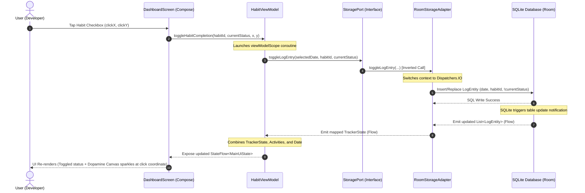

# System & Tech Architecture - HabitEngine

When I set out to build HabitEngine, I wanted to avoid the architectural decay that commonly affects solo projects over time. In past projects, I often found my Android UI activities cluttered with database cursors, business rules, and state management logic. To ensure HabitEngine remained testable, maintainable, and clean, I adopted **Hexagonal Architecture (Ports and Adapters)**. 

By separating the core domain rules from database persistence frameworks and UI rendering libraries, I built an engine where the core business logic remains pristine and independent of the external infrastructure.

---

## 1. Architectural Overview

The core principle of HabitEngine's Hexagonal Architecture is **dependency inversion**. The dependencies flow inwards: the UI and Database layers depend on the core domain and ports, but the domain has zero awareness of SQLite, Room, or Jetpack Compose.

```mermaid
graph TD
    subgraph Infrastructure Layer (Adapters)
        UI[Jetpack Compose UI<br/>DashboardScreen]
        DB[(Room SQLite DB<br/>AppDatabase / DAOs)]
    end

    subgraph Application / Port Layer
        VM[HabitViewModel]
        SP[StoragePort Interface]
    end

    subgraph Core Domain Layer
        Models[Domain Models<br/>Habit, ActivityLog, TrackerState]
        Rules[Pure Business Rules<br/>Cadence.isApplicableOn]
    end

    UI --> VM
    VM --> SP
    SP --> Models
    Rules --> Models
    
    %% DB implements StoragePort
    DB -.-> SP
```

This layout separates our application into three distinct boundaries:

1. **Core Domain Layer (`com.example.core.domain`)**:
   Contains pure data classes and business rule extension functions. It has no imports from `android.*`, `androidx.*`, or external libraries (like Room or JSON).
2. **Ports Layer (`com.example.core.ports`)**:
   Defines the interface boundaries (API) that the core application needs to talk to the outer world. In HabitEngine, [StoragePort](file:///d:/2026/Project/HabitEngine/app/src/main/java/com/example/core/ports/StoragePort.kt) defines all database query, save, and restore capabilities.
3. **Adapters / Infrastructure Layer (`com.example.infrastructure.adapters`)**:
   Implementations of the ports (Adapters) and visual systems.
   - **Database Adapter (`...adapters.database`)**: Uses Room ORM to map SQLite tables to domain entities and implements `StoragePort`.
   - **UI Adapter (`...adapters.ui`)**: Uses Jetpack Compose and standard Android `ViewModel` to drive reactive UI rendering.

---

## 2. Core Domain Isolation

Our domain models represent the mathematical truth of the habit loop system. In [Models.kt](file:///d:/2026/Project/HabitEngine/app/src/main/java/com/example/core/domain/Models.kt), the core entities are defined:

- `Habit`: Captures the psychological blueprint: `LifeDomain`, `Cadence`, `cueText`, `routineText`, and `rewardText`.
- `ActivityLog`: Tracks cognitive focus with categories (`IMPORTANT`, `TIME_WASTER`, `NEUTRAL`) and durations.
- `DayLog`: Models daily completions as a map of `HabitId -> Boolean`.
- `TrackerState`: The aggregate state holding all habits and completion records.

By keeping these models independent, I can calculate whether a habit is applicable on a selected date using a pure Kotlin extension function, completely isolated from SQL queries:

```kotlin
fun Cadence.isApplicableOn(dateStr: String): Boolean {
    // Isolated date conversion and evaluation logic
    // ...
    when (this) {
        Cadence.DAILY -> true
        Cadence.WEEKDAYS -> dayOfWeek != Calendar.SATURDAY && dayOfWeek != Calendar.SUNDAY
        Cadence.WEEKENDS -> dayOfWeek == Calendar.SATURDAY || dayOfWeek == Calendar.SUNDAY
        Cadence.MONTHLY -> calendar.get(Calendar.DAY_OF_MONTH) == 1
    }
}
```

---

## 3. Storage Interface (The Port)

The [StoragePort](file:///d:/2026/Project/HabitEngine/app/src/main/java/com/example/core/ports/StoragePort.kt) defines the contract for how our application retrieves and updates local data. It exposes reactive streams (`kotlinx.coroutines.flow.Flow`) so that any data modification automatically propagates to subscribers without manual polling:

```kotlin
interface StoragePort {
    fun loadTrackerState(): Flow<TrackerState>
    suspend fun saveHabit(habit: Habit)
    suspend fun toggleLogEntry(date: String, habitId: String, currentStatus: Boolean)
    suspend fun deleteHabit(habitId: String)
    fun loadActivityLogs(): Flow<List<ActivityLog>>
    suspend fun saveActivityLog(log: ActivityLog)
    suspend fun deleteActivityLog(id: String)
    suspend fun restoreBackup(
        habits: List<Habit>,
        logs: List<LogEntity>,
        activityLogs: List<ActivityLog>
    )
}
```

---

## 4. Infrastructure Adapters

### The Database Adapter (Room SQLite)
The SQL persistence is handled by [RoomStorageAdapter](file:///d:/2026/Project/HabitEngine/app/src/main/java/com/example/infrastructure/adapters/database/RoomStorageAdapter.kt). It acts as the driver adapter:
- It translates Room-specific entities ([RoomEntities.kt](file:///d:/2026/Project/HabitEngine/app/src/main/java/com/example/infrastructure/adapters/database/RoomEntities.kt)), such as `HabitEntity` and `LogEntity` (which have SQLite constraints, composite keys, and indexing rules), back and forth into clean Domain models (`Habit`, `TrackerState`).
- It shifts blocking database write/read operations safely onto `Dispatchers.IO` to ensure that database queries never block the Android Main UI Thread.

### The UI Adapter (MVVM Compose)
The graphical user interface drives interactions and updates using a unidirectional data flow (UDF) managed by [HabitViewModel](file:///d:/2026/Project/HabitEngine/app/src/main/java/com/example/infrastructure/adapters/ui/HabitViewModel.kt) and rendered reactively inside [DashboardScreen](file:///d:/2026/Project/HabitEngine/app/src/main/java/com/example/infrastructure/adapters/ui/DashboardScreen.kt):
- **Unidirectional Data Flow**: The Compose UI emits user events (e.g., clicking a habit card). The ViewModel receives these events and launches co-routines to invoke the matching suspend functions on `StoragePort`.
- **Reactive State Composition**: The ViewModel subscribes to the streams exposed by `StoragePort`, combines them with UI-specific state variables (selected date, theme modes, particle animations), and exposes a single read-only `StateFlow<MainUiState>` stream to the UI.

---

## 5. End-to-End Control Flow Example

To visualize the architecture in action, let's look at the flow of control when I tap a habit card on the dashboard to toggle its completion status:



By decoupling the layers this way, I've created an architecture where the database is a detail, the Compose UI is a detail, and my core business logic is highly protected, easily testable, and robust against platform changes.
