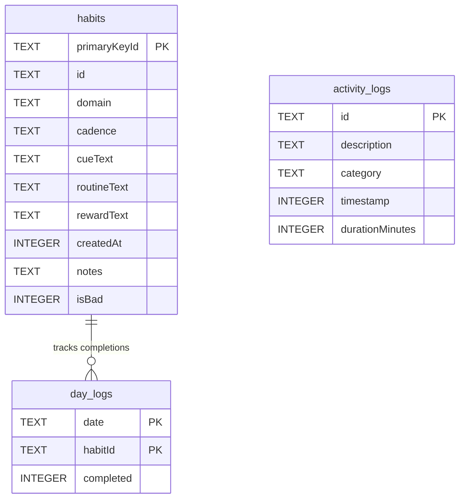

# Data Model & Backup APIs - HabitEngine

As a local-first, offline-first application, the database is the single source of truth for HabitEngine. This document describes the SQLite database schema managed via Jetpack Room, our core domain models, and the JSON schemas used for data portability (export and import backups).

---

## 1. Database Schema (SQLite / Room)

The application database is named `app_database` and is defined at schema version `3` in [RoomEntities.kt](file:///d:/2026/Project/HabitEngine/app/src/main/java/com/example/infrastructure/adapters/database/RoomEntities.kt). It contains three tables: `habits`, `day_logs`, and `activity_logs`.



### 1.1 The `habits` Table
Stores the structural definition of each habit loop created by the user.

| Column Name | SQLite Data Type | Room Field Name | Constraints / Details |
| :--- | :--- | :--- | :--- |
| `primaryKeyId` | `TEXT` | `primaryKeyId` | **PRIMARY KEY**. Maps to the habit `id`. |
| `id` | `TEXT` | `id` | Unique identifier string (UUID format). |
| `domain` | `TEXT` | `domain` | String value matching the `LifeDomain` enum names (`HEALTH`, `PROFESSIONAL`, `PERSONAL`, `FAMILY`). |
| `cadence` | `TEXT` | `cadence` | String value matching the `Cadence` enum names (`DAILY`, `WEEKDAYS`, `WEEKENDS`, `MONTHLY`). |
| `cueText` | `TEXT` | `cueText` | The trigger context (e.g. "When I wake up..."). |
| `routineText` | `TEXT` | `routineText` | The physical routine action (e.g. "I will drink a glass of water..."). |
| `rewardText` | `TEXT` | `rewardText` | The psychological reward (e.g. "to feel refreshed"). |
| `createdAt` | `INTEGER` | `createdAt` | Timestamp of loop formation (Millisecond Epoch). |
| `notes` | `TEXT` | `notes` | Optional user annotations. |
| `isBad` | `INTEGER` | `isBad` | Boolean represented as 0/1. Tracks if this is a negative habit loop we want to break. |

### 1.2 The `day_logs` Table
A ledger of completion records. Instead of using a surrogate key, it uses a **composite primary key** to prevent duplicate logs on the same date for the same habit.

| Column Name | SQLite Data Type | Room Field Name | Constraints / Details |
| :--- | :--- | :--- | :--- |
| `date` | `TEXT` | `date` | **COMPOSITE PK (Part 1)**. ISO date format `YYYY-MM-DD`. |
| `habitId` | `TEXT` | `habitId` | **COMPOSITE PK (Part 2)**. Matches the target habit UUID. |
| `completed` | `INTEGER` | `completed` | Boolean represented as 0/1. Indicates if the habit was checked off. |

### 1.3 The `activity_logs` Table
Logs focus states, activities, and time-wasting events in the cognitive terminal logger.

| Column Name | SQLite Data Type | Room Field Name | Constraints / Details |
| :--- | :--- | :--- | :--- |
| `id` | `TEXT` | `id` | **PRIMARY KEY**. Unique UUID string. |
| `description` | `TEXT` | `description` | Details of the logged activity (e.g., "Wrote documentation"). |
| `category` | `TEXT` | `category` | String matching `ActivityCategory` enum names (`IMPORTANT`, `TIME_WASTER`, `NEUTRAL`). |
| `timestamp` | `INTEGER` | `timestamp` | Millisecond Epoch timestamp when the entry was logged. |
| `durationMinutes` | `INTEGER` | `durationMinutes` | Duration of the activity in minutes. |

---

## 2. Domain Models & In-Memory Representation

While the database stores flat schemas, the core business engine maps them into rich Kotlin objects in [Models.kt](file:///d:/2026/Project/HabitEngine/app/src/main/java/com/example/core/domain/Models.kt).

### 2.1 Enums
- **`LifeDomain`**: Used to group habits:
  - `HEALTH` ➔ UI Display: *"Health"*
  - `PROFESSIONAL` ➔ UI Display: *"Professional"*
  - `PERSONAL` ➔ UI Display: *"Personal"*
  - `FAMILY` ➔ UI Display: *"Social"*
- **`Cadence`**: Dictates filters:
  - `DAILY`, `WEEKDAYS`, `WEEKENDS`, `MONTHLY`
- **`ActivityCategory`**: Segregates cognitive log priority:
  - `IMPORTANT`, `TIME_WASTER`, `NEUTRAL`

### 2.2 Aggregate State Representation
To allow sub-10ms UI renders, when Room flows list data, the [RoomStorageAdapter](file:///d:/2026/Project/HabitEngine/app/src/main/java/com/example/infrastructure/adapters/database/RoomStorageAdapter.kt) groups and maps the flat list of `LogEntity` tables into a nested hash map:

```kotlin
data class TrackerState(
    val habits: List<Habit> = emptyList(),
    val logs: Map<String, Map<String, Boolean>> = emptyMap() 
    // date (YYYY-MM-DD) -> HabitId -> CompletionStatus
)
```
This structured format allows the UI to instantly query the completion state of a habit card on the active dashboard date with $O(1)$ complexity, avoiding nested database queries.

---

## 3. Backup JSON API Schema

To ensure that I never lose my history and have absolute ownership of my data, I implemented custom JSON import/export APIs in the [HabitViewModel](file:///d:/2026/Project/HabitEngine/app/src/main/java/com/example/infrastructure/adapters/ui/HabitViewModel.kt).

### 3.1 JSON Payload Specification
The exported file is a single JSON object containing three arrays and key blocks. Below is an annotated, valid export payload:

```json
{
    "habits": [
        {
            "id": "e932b1cb-a035-430c-99d9-299f182fb0bd",
            "domain": "PROFESSIONAL",
            "cadence": "WEEKDAYS",
            "cueText": "When I finish my afternoon coffee",
            "routineText": "I will review my open pull requests for 15 minutes",
            "rewardText": "to maintain clean ship flow",
            "createdAt": 1780018936738,
            "notes": "Focused heavily on team code standards",
            "isBad": false
        }
    ],
    "logs": {
        "2026-06-05": {
            "e932b1cb-a035-430c-99d9-299f182fb0bd": true
        },
        "2026-06-06": {
            "e932b1cb-a035-430c-99d9-299f182fb0bd": true
        }
    },
    "activityLogs": [
        {
            "id": "3b29c9c8-0ad5-4a67-9dfb-5bbad42ad8a0",
            "description": "Debugging Gradle Wrapper settings and properties configurations",
            "category": "IMPORTANT",
            "timestamp": 1780018964105,
            "durationMinutes": 45
        }
    ]
}
```

### 3.2 Export Engine Details
In [HabitViewModel.exportBackupAsJson()](file:///d:/2026/Project/HabitEngine/app/src/main/java/com/example/infrastructure/adapters/ui/HabitViewModel.kt#L197-L249), I construct this payload dynamically using the platform standard `org.json` package:
1. It queries the current value of the `uiState` flow.
2. It loops through the active `habits` list, mapping domains and properties into a `JSONArray`.
3. It iterates over the nested `logs` map, writing key-value mappings of date-strings to habit UUID flags.
4. It compiles `activityLogs` into another array and formats the root object with a readable indent of `4`.

### 3.3 Import & Transactional Restore Engine
The restoration method `restoreBackupFromJson` in [HabitViewModel.kt](file:///d:/2026/Project/HabitEngine/app/src/main/java/com/example/infrastructure/adapters/ui/HabitViewModel.kt#L251-L327) handles imports. 

To prevent data corruption if a backup file is malformed or interrupted halfway, the entire restore process is piped to [RoomStorageAdapter.restoreBackup()](file:///d:/2026/Project/HabitEngine/app/src/main/java/com/example/infrastructure/adapters/database/RoomStorageAdapter.kt#L125-L167). This function runs inside a database transaction:
1. It wipes all records from the `habits` table.
2. It wipes all records from the `day_logs` table.
3. It wipes all records from the `activity_logs` table.
4. It parses and inserts the new rows sequentially.

If any JSON key parsing fails, the adapter throws an exception, prompting a transaction rollback, which restores the database to its exact pre-import state.
